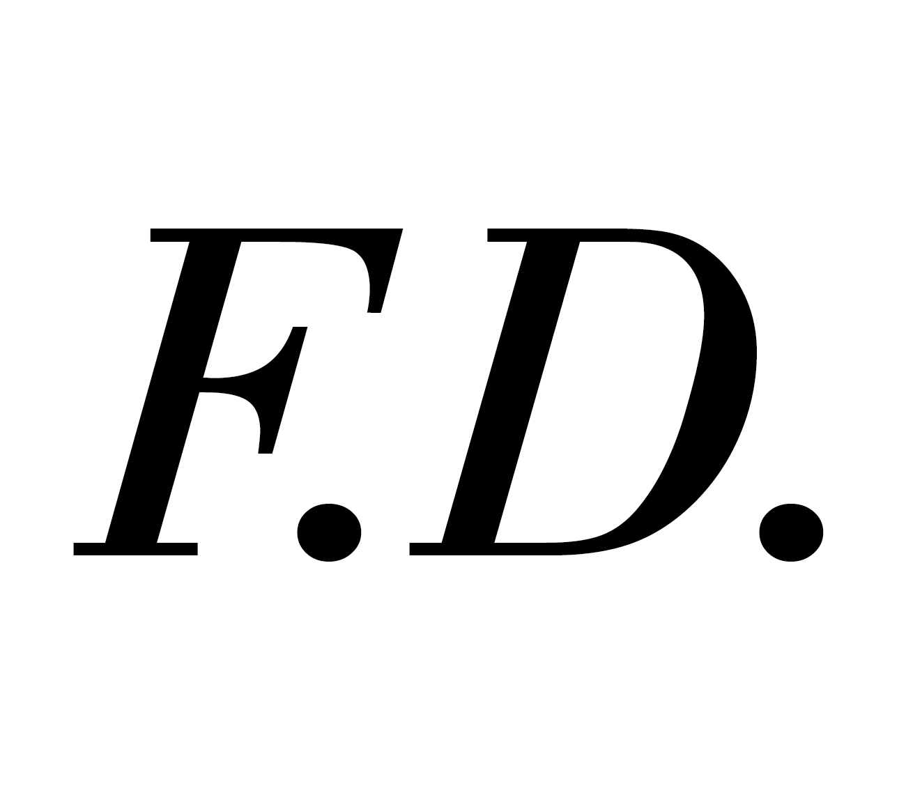

## Franqsanz Dev 2019 (Franco Andrés Sánchez)

Un sitio personal que utilizare como **portafolio de CV**, y tambien para que me contacten.
##### Tecnologias utilizadas en este Proyecto:
* Handlebars.js
* CSS
* JavaScript
* Node.js(Express.js)
* MongoDB
___
*Version de la Web: 0.0.1*
___
[Visita mi perfil de Instagram](https://instagram.com/franqsanz)
[Visita mi perfil de GitHub](https://www.github.com/franqsanz)
[Visita el Sitio Web](https://www.franqsanzdev.com/)